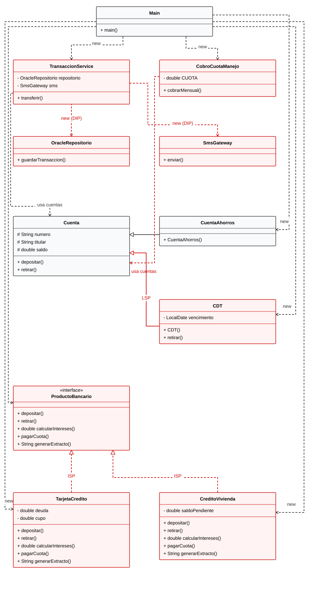
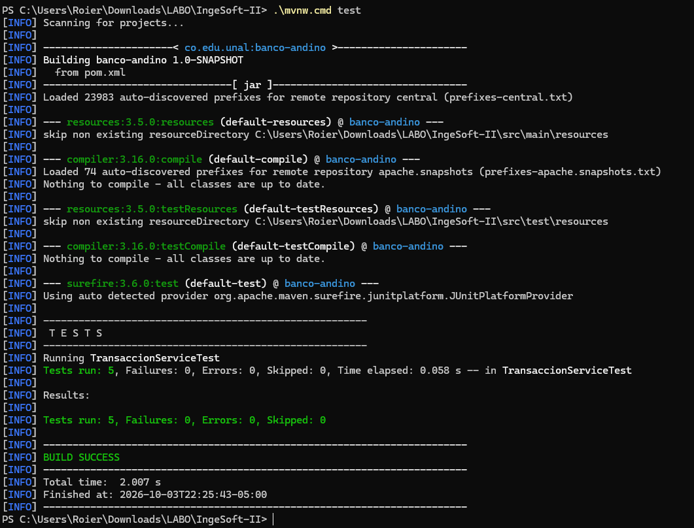

# Laboratorio L2: SOLID

- Lenguaje: Java 21
- Proyecto: Backend de Banco Andino
- Base: código original del laboratorio, conservado para el diagnóstico.

## Bloque 1 — Diagnóstico

### 1.1 Tabla de hallazgos

| Clase / método | Letra | Evidencia en el código | Consecuencia para el banco o el cliente |
|---|---|---|---|
| "TransaccionService.transferir" ("TransaccionService.java", líneas 7–42) | S | Valida, calcula comisión, mueve dinero, persiste, imprime el comprobante, notifica y audita. | Un cambio de formato del comprobante obliga a editar la clase que mueve el dinero; un error de presentación puede afectar una operación financiera. |
| "TransaccionService.transferir" ("TransaccionService.java", líneas 14–18) | O | El "switch" selecciona la comisión según "tipo". | Agregar un tipo de transferencia exige editar el servicio y puede alterar por accidente una comisión existente. |
| "CDT.retirar" ("CDT.java", líneas 11–18) y "CobroCuotaManejo.cobrarMensual" ("CobroCuotaManejo.java", líneas 6–10) | L | "CDT" hereda de "Cuenta", pero rechaza "retirar" antes del vencimiento; el cobro acepta cualquier "Cuenta". | El proceso mensual puede detenerse al encontrar un CDT. Las cuentas procesadas antes ya fueron cobradas y las siguientes quedan pendientes. |
| "ProductoBancario.java", líneas 1–6, y sus implementaciones | I | La interfaz exige "depositar" y "retirar"; "TarjetaCredito" y "CreditoVivienda" dejan métodos vacíos porque no aplican. | Un cliente puede invocar una operación que el producto no admite y recibir una respuesta silenciosa, sin saber que no ocurrió nada. |
| "TransaccionService.java", líneas 4–5 | D | Construye "OracleRepositorio" y "SmsGateway" con "new". | El servicio queda acoplado a esas clases y no permite sustituirlas por dobles sin modificarlo, lo que dificulta aislar pruebas y cambiar proveedores. |

### 1.2 Experimentos

El CDT. Se incluyó temporalmente el CDT de Ana en la lista de "cobrarMensual". La ejecución cobró primero a Ana y Luis y luego lanzó "UnsupportedOperationException" al intentar retirar del CDT antes de su vencimiento. El saldo del CDT no cambió. El lote no continuó ni revirtió los cobros anteriores. Si el CDT fuera la cuenta número 500.000, las 499.999 anteriores quedarían cobradas y el resto del millón no se procesaría.

La prueba de la comisión. Una prueba temporal llamó a "transferir" por $150.000 a otro banco, capturó la salida y comprobó la comisión de $7.500 y los saldos finales. Si las conexiones fueran reales, la respuesta es no: "TransaccionService" crea directamente esas dependencias y no permite sustituirlas por dobles. Nota: esta ejecución no accedió a Oracle ni envió SMS porque, en este código base, "OracleRepositorio" y "SmsGateway" solo imprimen en consola. La prueba tuvo que capturar la salida para observar la comisión, pues "transferir" no la devuelve.

### 1.3 Medición “antes”

| Métrica | Antes |
|---|---:|
| Líneas del método "transferir" | 36 (líneas 7–42, contando comentarios y líneas vacías) |
| Razones distintas por las que "TransaccionService" podría cambiar | 7: validación, comisión, movimiento, persistencia, comprobante, notificación y auditoría |
| Clases concretas que "TransaccionService" crea con "new" | 2: "OracleRepositorio" y "SmsGateway" |
| Métodos vacíos por “no aplica” | 3: "TarjetaCredito.depositar", "CreditoVivienda.depositar" y "CreditoVivienda.retirar"; "CDT.retirar" también puede lanzar "UnsupportedOperationException", pero por una restricción temporal de negocio |
| ¿Se puede probar sin conexión a Oracle ni envío de SMS? | No: el servicio crea directamente esas dependencias y no permite sustituirlas por dobles. Nota: en esta simulación, ambas clases solo imprimen. |

### 1.4 Diagrama UML del código original

Las relaciones problemáticas de herencia, implementación y dependencia están marcadas en rojo. La dependencia de "TransaccionService" hacia "Cuenta" conserva el color normal.



## Bloque 2 — Refactorización

### Punto de control S

Después del cambio, describan en una frase qué hace "TransaccionService".

"TransaccionService" coordina la ejecución de una transferencia.

¿Aparece la palabra "y"?

No se enumeran responsabilidades adicionales: la responsabilidad del servicio es coordinar la transferencia.

La validación del monto queda en "ValidadorTransferencia", la comisión en "CalculadoraComision", el comprobante en "GeneradorComprobante", el mensaje de notificación en "NotificadorTransferencia" y la auditoría en "RegistroAuditoria". El servicio conserva el orden de ejecución de estas operaciones.

Si el área legal pide cambiar el formato del comprobante, ¿qué archivo tocan?

"GeneradorComprobante.java", que contiene la presentación del comprobante.

### Punto de control O

Si mañana llega un tipo de transferencia nuevo, ¿qué archivos existentes tendrían que modificar? Enumérenlos.

1. "Main.java": registrar la nueva política con el nombre del tipo de transferencia.

Se añade una clase que implemente "PoliticaComision" para definir la comisión nueva. "CalculadoraComision" consulta las políticas registradas y delega el cálculo; ya no contiene el "switch". "TransaccionService" recibe la calculadora configurada desde "Main".

### Punto de control L

¿Su solución detecta el error al compilar o al ejecutar?

Al compilar. "CDT" ya no hereda de "Cuenta": ambos comparten "ProductoConSaldo", que ofrece identificación, saldo y depósito, pero no promete retiros libres. "CobroCuotaManejo" acepta una lista de "Cuenta", por lo que incluir un CDT produce un error de tipos.

¿Por qué es mejor lo primero?

La incompatibilidad se detecta antes de ejecutar el proceso de cobro. Se evita que el lote cobre algunas cuentas y falle después al encontrar el CDT.

Si alguien propone envolver el retiro en un try/catch e ignorar los CDT, ¿por qué eso no resuelve el problema de diseño?

Solo oculta el fallo durante la ejecución. El CDT seguiría presentado como una cuenta sustituible aunque no cumpla el contrato de retiro, y otros clientes de esa jerarquía podrían encontrar el mismo problema.

Se extrajo el estado común a "ProductoConSaldo". "Cuenta" conserva el retiro libre sujeto al saldo disponible; "CDT" conserva su restricción de vencimiento. "Main" declara el CDT con su tipo propio.

### Punto de control I

¿Pudieron lograr que un mismo generador de extractos funcione para cuentas, tarjetas y créditos a la vez?

Sí. "GeneradorExtractos" puede imprimir una lista que contenga "CuentaAhorros", "TarjetaCredito" y "CreditoVivienda".

¿Qué interfaz necesitó para eso, y por qué no necesitó conocer los demás métodos de cada producto?

"ProductoBancario", reducida al método "generarExtracto". El generador solo necesita obtener e imprimir ese texto; no utiliza depósitos, retiros, intereses ni pagos.

Los métodos "calcularIntereses" y "pagarCuota" se agruparon en "ProductoCredito", implementada por la tarjeta y el crédito de vivienda. Se eliminaron "TarjetaCredito.depositar", "CreditoVivienda.depositar" y "CreditoVivienda.retirar", cuyos cuerpos estaban vacíos. "Cuenta" implementa su extracto y "Main" utiliza el generador común con los mismos productos de antes.

### Punto de control D

¿Cuántas clases concretas conoce ahora "TransaccionService"?

Ninguna implementación concreta de la aplicación. Sus seis colaboradores y las cuentas se utilizan mediante interfaces. El servicio recibe los colaboradores por constructor y no crea dependencias con "new".

¿Quién decide si se usa Oracle o si se notifica por SMS?

"Main.java", donde se arma el sistema: selecciona "OracleRepositorio" y entrega un "SmsGateway" a "NotificadorTransferencia". El notificador recibe "CanalNotificacion" y tampoco crea su proveedor.

Vuelvan al experimento 2 del bloque 1: ¿ya es posible esa prueba?

Sí. Se sustituyeron el repositorio y el canal de notificación por dobles en memoria, y el comprobante y la auditoría por implementaciones silenciosas. La prueba verificó una comisión de $7.500, los saldos finales, los datos registrados y el mensaje, sin crear Oracle ni el proveedor SMS. También comprobó que un monto inválido no genera registros ni mensajes.

Se definieron contratos pequeños para validación, cálculo de comisión, persistencia, comprobante, notificación, auditoría, canal de mensajes y operaciones de cuenta. Las implementaciones existentes cumplen esos contratos y "Main" conecta todas las dependencias.

## Bloque 3 — Pruebas unitarias

Se configuraron JUnit y Maven Wrapper. Las pruebas están en "src/test/java" y utilizan cuentas, validación y políticas de comisión reales. "RepositorioEnMemoria" guarda los registros y "NotificadorEnMemoria" conserva las notificaciones; el comprobante y la auditoría utilizan implementaciones silenciosas.

Las cinco pruebas cubren:

1. Transferencia al mismo banco sin comisión y con movimiento exacto del monto.
2. Transferencia a otro banco con comisión de $7.500 descontada del origen.
3. Saldo insuficiente sin registros, notificaciones ni cambios de saldo.
4. Una transferencia exitosa con un registro y una notificación.
5. Tipo desconocido rechazado sin cambios de saldo ni efectos externos.

¿Cuánto tardan en ejecutarse todas sus pruebas?

Las cinco pruebas tardaron 58 ms según el reporte de Maven Surefire de la ejecución en Windows mostrada abajo. Es el tiempo de ejecución de las pruebas; no incluye las descargas, la compilación ni el arranque de Maven.

¿Cuántas líneas de "TransaccionService" tuvieron que cambiar para poder probarla?

Cero. El constructor y las interfaces del control D permiten sustituir sus dependencias por dobles.

¿Qué habría pasado si intentaran estas mismas pruebas en el bloque 1?

El servicio creaba directamente "OracleRepositorio" y "SmsGateway", por lo que no se podían sustituir por dobles. Bajo el supuesto de conexiones reales de la guía, las pruebas accederían a la base de producción y enviarían mensajes al cliente.



## Bloque 4 — Negocio pidió cambios

Antes de programar cada requerimiento se revisó el código del commit "bloque-0-codigo-base" para estimar cuántos archivos existentes habría que modificar allí. Luego se implementó sobre el código refactorizado. Los conteos de la tabla del final de esta sección incluyen código de producción y pruebas; no incluyen este README.

### R1 — Transferencias por llave

"ComisionLlave" implementa "PoliticaComision" y devuelve 0. "Main" la registra con el tipo "LLAVE". "TransaccionService" y "CalculadoraComision" no cambiaron: es exactamente el escenario del punto de control O. La búsqueda de la cuenta a partir de la llave no se implementó, como indica el enunciado.

Criterio de aceptación: "TransferenciaLlaveTest" transfiere $50.000 por llave y verifica que el origen pasa de $1.000.000 a $950.000 y que la comisión guardada es 0.

### R2 — Cuenta infantil

Estimación en el código original: 0 archivos existentes. "CuentaInfantil" podía heredar de "Cuenta" como un archivo nuevo y sobrescribir "retirar". Al implementarlo apareció el problema de la cuota de manejo descrito abajo, que en el código original habría obligado a modificar también "Cuenta.java" y "CobroCuotaManejo.java".

Implementación: se creó "CuentaInfantil", que hereda de "Cuenta" y sobrescribe "retirar" para acumular los retiros del día. Si el nuevo retiro supera $200.000, lanza "IllegalStateException" antes de descontar el saldo. Los depósitos se heredan sin cambios. Para probar el cambio de día sin esperar, la cuenta puede recibir un "Clock"; si no se entrega uno, usa el reloj del sistema.

La primera versión se pudo extender sin tocar archivos existentes, pero reintroducía el fallo del CDT. Con "CobroCuotaManejo" usando "retirar", la cuota de una cuenta infantil que ya hubiera retirado $200.000 ese día lanzaría una excepción y detendría el lote nocturno, el mismo problema que el CDT causaba en el bloque 1. La cuota es un cargo del banco y no un retiro del cliente, así que se separaron las dos operaciones y se modificaron 2 archivos existentes:

- "Cuenta.java": nuevo método "cobrarCargo", declarado "final" para que ninguna subclase le agregue restricciones. Solo verifica el saldo disponible.
- "CobroCuotaManejo.java": usa "cobrarCargo" en lugar de "retirar".

Lección para el diseño: en el control L, "Cuenta.retirar" seguía siendo una operación que las subclases podían restringir. Como el cobro dependía de ella, la jerarquía no estaba protegida frente a nuevas cuentas con reglas de retiro.

La prueba "CuentaInfantilTest" verifica el criterio de aceptación: con $150.000 retirados ese día, un retiro de $60.000 se rechaza y el saldo no cambia. También comprueba que el límite se reinicia al día siguiente, que los depósitos no tienen límite, que la cuenta sirve como origen de transferencias y que se le cobra la cuota aunque ya haya alcanzado el límite. Una transferencia queda sujeta al mismo límite, incluida su comisión: con $150.000 retirados, una transferencia a otro banco de $45.000 ($52.500 con la comisión) se rechaza sin mover dinero. La salida del programa principal no cambia.

### R3 — Notificaciones push

"PushGateway" implementa "CanalNotificacion" e imprime los mensajes "[PUSH]". "CanalNotificacionCompuesto" también implementa "CanalNotificacion" y reenvía el mensaje a cada canal de su lista. "Main" entrega a "NotificadorTransferencia" un compuesto con "SmsGateway" y "PushGateway". El texto del mensaje sigue en un solo lugar ("NotificadorTransferencia"), y "TransaccionService" sigue llamando una sola vez al notificador, por lo que la prueba 4 del bloque 3 no cambió.

Criterio de aceptación: "NotificacionPushTest" arma el servicio con los dos canales reales, captura la consola y verifica un mensaje "[SMS]" y uno "[PUSH]" para la transferencia. "SalidaConsola" es una utilidad de prueba para capturar la consola; se reutiliza en R4.

### R4 — Sistema antifraude

"SistemaAntifraude" implementa "AuditoriaTransferencia" e imprime el mensaje "[ANTIFRAUDE]". "AuditoriaCompuesta" ejecuta en orden las auditorías de su lista. "Main" entrega una con "RegistroAuditoria" y "SistemaAntifraude". La auditoría actual no cambió. "TransaccionService" registra la auditoría como último paso, así que una transferencia rechazada no llega ni a la auditoría ni al antifraude.

Criterio de aceptación: "AntifraudeTest" verifica un "[AUDITORIA]" y un "[ANTIFRAUDE]" por transferencia exitosa, y ninguno cuando se rechaza por saldo insuficiente.

Análisis honesto: el antifraude reutiliza la interfaz "AuditoriaTransferencia", cuyo nombre es más específico que su papel real: "acción posterior a una transferencia exitosa". Funciona sin modificar el servicio, pero quien lea "Main" puede sorprenderse de ver el antifraude dentro de una "auditoría". Propuesta: renombrar la interfaz a algo como "ObservadorTransferencia". No se hizo para no modificar archivos existentes en este bloque.

### R5 — Migración a PostgreSQL

"PostgresRepositorio" implementa "RepositorioTransacciones" e imprime los mensajes "[POSTGRES]". "Main" lo usa en lugar de "OracleRepositorio", que se conserva sin cambios por si hay que devolverse. Las pruebas no cambiaron porque usan "RepositorioEnMemoria" y nunca conocieron Oracle.

### Tabla del bloque 4

| Req. | Archivos a modificar en el código original (estimado) | Archivos existentes modificados (real) | Archivos nuevos | ¿Se rompió alguna prueba? |
|---|---|---|---|---|
| R1 | 1: "TransaccionService.java" (nuevo "case" en el "switch") | 1: "Main.java" | 2: "ComisionLlave.java", "TransferenciaLlaveTest.java" | No |
| R2 | 0: una clase nueva que herede de "Cuenta" y sobrescriba "retirar" | 2: "Cuenta.java", "CobroCuotaManejo.java" | 2: "CuentaInfantil.java", "CuentaInfantilTest.java" | No |
| R3 | 1: "TransaccionService.java" (crear "PushGateway" con "new" y llamarlo), más el archivo nuevo del gateway | 1: "Main.java" | 4: "PushGateway.java", "CanalNotificacionCompuesto.java", "NotificacionPushTest.java", "SalidaConsola.java" | No |
| R4 | 1: "TransaccionService.java" (nueva llamada después de la auditoría) | 1: "Main.java" | 3: "SistemaAntifraude.java", "AuditoriaCompuesta.java", "AntifraudeTest.java" | No |
| R5 | 1: "TransaccionService.java" (reemplazar "new OracleRepositorio()"), más el archivo nuevo de PostgreSQL | 1: "Main.java" | 1: "PostgresRepositorio.java" | No |

Al terminar los cinco requerimientos se ejecutan 15 pruebas: las 5 del bloque 3, sin cambios, y 10 nuevas. Todas pasan.

### Análisis

En el código original, R1, R3, R4 y R5 caen en "TransaccionService", la clase que mueve el dinero y que no se podía probar sin Oracle ni SMS. En el código refactorizado, R1, R3, R4 y R5 solo cambiaron "Main.java", el punto donde se arma el sistema; la lógica de transferencia no se tocó en ningún requerimiento. Un error al editar "Main" afecta la configuración, mientras que un error al editar "transferir" puede cobrar mal una transferencia. Además, cada requerimiento quedó con pruebas propias que corren sin infraestructura.

R2 fue el requerimiento que el diseño no aguantó por sí solo. Para que el cobro de la cuota no dependiera de las reglas de retiro de cada cuenta hubo que modificar "Cuenta.java" y "CobroCuotaManejo.java", así que la suma de la columna de archivos existentes modificados es 6 (3 archivos distintos): "Main.java" en cuatro requerimientos, y "Cuenta.java" y "CobroCuotaManejo.java" en R2. El cambio de R2 corrige un punto débil que había quedado del control L y deja la jerarquía protegida para la próxima cuenta con restricciones de retiro.

### Salida del programa después del bloque 4

La salida del programa principal cambió a propósito: ahora guarda en PostgreSQL, notifica por SMS y push, y reporta al antifraude después de la auditoría. El resto de la salida es la misma de "salida_original.txt".

```text
[POSTGRES] Conectando a jdbc:postgresql://prod-db:5432/banco...
[POSTGRES] INSERT INTO transacciones VALUES ('001-1', '001-2', 150000.0, 7500.0)
===== BANCO ANDINO - COMPROBANTE =====
Origen: 001-1
Destino: 001-2
Monto:    $150000.0
Comisión: $7500.0
======================================
[SMS] Conectando al proveedor de mensajería...
[SMS] Para Ana: Transferiste $150000.0 a la cuenta 001-2
[PUSH] Conectando al servicio de notificaciones de la app...
[PUSH] Para Ana: Transferiste $150000.0 a la cuenta 001-2
[AUDITORIA] 2026-10-04T13:18:09.161119436 OTRO_BANCO 001-1 -> 001-2 $150000.0
[ANTIFRAUDE] Reportando transacción OTRO_BANCO 001-1 -> 001-2 $150000.0
Cuota de manejo cobrada a 001-1
Cuota de manejo cobrada a 001-2
Tarjeta - deuda: $0.0
Crédito vivienda - pendiente: $1.2E8
```


## Bloque 5 — Revisión cruzada (R6: pago de servicios públicos)

### Qué se implementó

Un pago de servicios se modeló como una transferencia cuyo destino es una factura, de modo que se reutilizó "TransaccionService" sin copiar su lógica.

| Archivo | Estado | Función |
|---|---|---|
| "ComisionFija.java" | Nuevo | "PoliticaComision" que devuelve un valor fijo. |
| "TipoServicio.java" | Nuevo | Enum con AGUA, LUZ, GAS e INTERNET. |
| "FacturaServicio.java" | Nuevo | Destino del pago; su número es la referencia de la factura. |
| "PagoServicios.java" | Nuevo | Expone "pagar(origen, servicio, referencia, valor)" y delega en "transferir". |
| "PagoServiciosTest.java" | Nuevo | Cuatro pruebas del requerimiento. |
| "Main.java" | Modificado | Registra la política "PAGO_SERVICIO" con $1.500 y hace un pago de demostración. |

Reutilizado sin cambios: validación de monto, cálculo de comisión, movimiento de saldos, repositorio, comprobante, notificación, auditoría y antifraude. Un CDT no puede pagar servicios porque no implementa "CuentaTransaccional": "pagar(cdt, ...)" no compila.

Criterio de aceptación: un pago de $184.300 descuenta $185.800 de la cuenta (saldo de 1.000.000 a 814.200), guarda la transacción ("001", "REF-884213", 184300.0, 1500.0) e imprime el comprobante con "Destino: REF-884213".

### Lista de revisión

| Ítem | Sí | No |
|---|:-:|:-:|
| Entendimos qué hace cada clase leyendo solo su nombre y sus métodos públicos | X | |
| Pudimos reutilizar piezas existentes sin copiar y pegar código | X | |
| Implementamos el requerimiento sin modificar la lógica de clases existentes | X | |
| No encontramos métodos vacíos ni que lancen "no aplica" | X |  |
| No encontramos if/switch por tipo que tuvimos que extender | X | |
| Las pruebas existentes siguieron pasando después de nuestro cambio | X | |
| No encontramos abstracciones innecesarias (interfaces que no aportan) | X | |

### Lo mejor del diseño

1. **"TransaccionService" solo coordina.** Recibe seis colaboradores por constructor, todos mediante interfaces pequeñas (validación, comisión, repositorio, comprobante, notificación y auditoría), y no crea nada con "new". Por eso se puede probar con dobles en memoria, sin Oracle ni SMS, y cada cambio de presentación o de proveedor queda fuera de la clase que mueve el dinero.
2. **Los compuestos permiten sumar comportamiento sin tocar el flujo.** "CanalNotificacionCompuesto" y "AuditoriaCompuesta" hicieron posible agregar push (R3) y antifraude (R4) con el servicio llamando una sola vez al notificador y a la auditoría. La migración a PostgreSQL (R5) fue una implementación nueva de "RepositorioTransacciones".
4. **La jerarquía de productos protege contra errores de contrato.** "CDT" no hereda de "Cuenta"; ambos comparten "ProductoConSaldo". Por eso un CDT no entra en el cobro de cuota ni en un pago de servicios: el error aparece al compilar, no a mitad de un lote. Además, "cobrarCargo" es "final", así que ninguna cuenta nueva con reglas de retiro puede detener el cobro de la cuota.
5. **Las pruebas son rápidas y no dependen de infraestructura.** Los dobles ("RepositorioEnMemoria", "NotificadorEnMemoria", "SalidaConsola") se reutilizaron en todos los requerimientos, incluido el 6.


### Lo que nos costó entender o extender

1. El comprobante, el notificador y la auditoría reciben "CuentaTransaccional" como destino, aunque solo usan "getNumero" y "getTitular". Para un destino que no es una cuenta hubo que presentarlo como cuenta, con un "retirar" que no aplica. Mejora propuesta: extraer una interfaz pequeña "DestinoTransferencia" ("getNumero", "getTitular", "depositar") y usarla en esos contratos.
2. "AuditoriaTransferencia" también aloja el antifraude, como ya señaló la otra pareja en R4.
3. "TransaccionService" es una clase concreta sin interfaz, por lo que "PagoServicios" depende directamente de ella.
